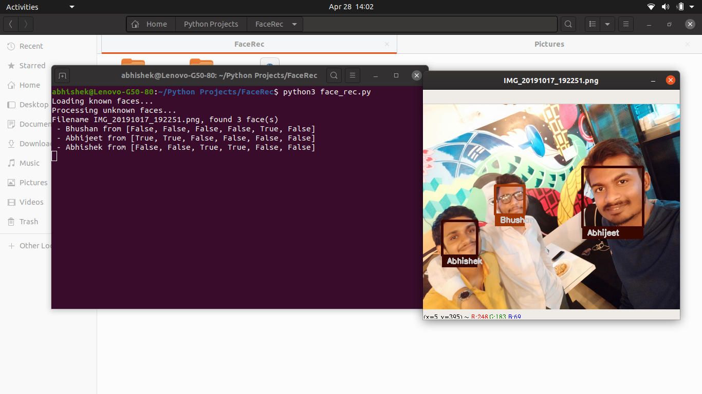

# Simple-Face-Recognition
Python script for Face recognition using OpenCV

# Running the script:

Requirements for Linux

Install dlib https://pypi.org/project/dlib/

pip3 install --upgrade numpy scipy

Install face recognition module https://github.com/ageitgey/face_recognition

Install git client and cmake

# Result

For an unknown Image

